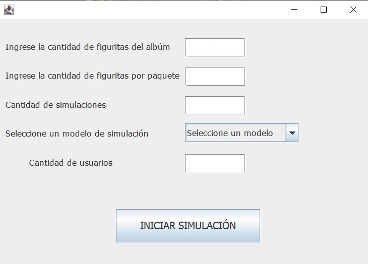

= Trabajo práctico 2
== Segundo Semestre 2022
 
*Integrantes*

Mendez Agustina <agustina.996@hotmail.com>

*Docentes*

* Patricia Bagnes
* Javier Marenco

== Introducción

El objetivo del trabajo práctico es estimar cuánto dinero en promedio se debe gastar para completar el álbum de figuritas del mundial en distintos escenarios, por medio de técnicas de simulación. El álbum contiene 638 figuritas y cada paquete tiene 5 figuritas distintas. Suponemos además que la probabilidad de aparición de cada figurita en cada paquete es la misma, es decir que se imprime la misma cantidad de cada figurita y que las figuritas se reparten con distribución uniforme entre los paquetes.

Una simulación consiste en comenzar con un álbum vacio y generar aleatoriamente paquetes de figuritas hasta completar el álbum, llevando la cuenta de cuantos paquetes fueron necesarios para terminar el procedimiento. La estimación consiste en realizar un número muy grande de simulaciones hasta llegar a una estimación (promedio de los paquetes comprados hasta finalizar el proceso) estable.

La aplicación cuenta con una interfaz donde el usuario deberá ingresar los datos para la simulación. Una vez ingresados todos los datos, podrá iniciar la simulación. Los datos que se pueden ingresar, estan limitados a valores numéricos. Podemos accionar el botón INICIAR SIMULACIÓN haciendo click sobre el mismo.

Una vez iniciado se llama al metodo iniciarSimulacion (cant simulaciones) que es el encargado de ejecutar cada simulación hasta llegar al número de simulaciones pedido por el usuario. Además, guarda los datos de los paquetes que fueron necesarios para el total de simulaciones y luego lo divide para obtener, en promedio, cuantos paquetes se necesitan para completar el álbum. 

[source, java]
----
  public double iniciarSimulacion(int cantidadSimulaciones) {
    int cont = 0;
    int paquetes = 0;
    while (cont < cantidadSimulaciones) {
      AlbumControlador albumControlador = new AlbumControlador(cantidadUsuarios, cantidadFiguritasPorAlbum, cantidadFiguritasPorPaquete, tipoSimulcaion);
      albumControlador.complearAlbumes();
      for (int i = 0; i < albumControlador.getAlbumes().length; i++) {
        paquetes += albumControlador.getAlbumes()[i].getCantidadPaquetesFiguritasNecesarias();
      }
      cont ++;
    }
    paquetesPromedio = Math.ceil(paquetes /cantidadSimulaciones);
    return paquetesPromedio;
  }
----

En cada simulación se crea un álbum controlador, con todos los datos necesarios para la simulación. La clase AlbumControlador contiene al metodo completarAlbumes que verifica que escenario de simulación fue escogida y llama, según corresponda, al metodo completarAlbumCaso1(), completarAlbumCaso2(), completarAlbumCaso3(). 

[source, java]
----
  public void completarAlbumCaso1() {
  	while (!this.albumes[0].elAlbumEstaCompleto()) {
  		PaqueteFigurita paqueteFigurita = crearPaqueteFigurita();
  		this.albumes[0].agregarPaqueteFigurita(paqueteFigurita);
      }
  	}
	public void completarAlbumesCaso2() {
		HashMap<Integer, List<Figurita>> figuritasRepetidas = new HashMap<>();
		while (!estanTodosLosAlbumesCompletos()) {
			for (int i = 0; i < albumes.length; i++) {
				agregarFiguritasRepetidasEnAlbum(figuritasRepetidas, albumes[i]);
				if (!albumes[i].elAlbumEstaCompleto()) {
					PaqueteFigurita paqueteFigurita = crearPaqueteFigurita();
					albumes[i].agregarPaqueteFigurita(paqueteFigurita);
					HashMap<Integer, List<Figurita>> figuritasRepetidasActual = albumes[i].getFiguritasRepetidas();
					albumes[i].setFiguritasRepetidas(new HashMap<>());
					for (Integer index : figuritasRepetidasActual.keySet()) {
						if (figuritasRepetidasActual.get(index) != null) {
							List<Figurita> repetidasExistentes = figuritasRepetidas.get(index);
							if (repetidasExistentes == null) {
								repetidasExistentes = new ArrayList<>();
								repetidasExistentes.addAll(figuritasRepetidasActual.get(index));
							} else {
								repetidasExistentes.addAll(figuritasRepetidasActual.get(index));
							}
						}
					}
				}
			}
		}
	}
	public void completarAlbumesCaso3() {
		while (!estanTodosLosAlbumesCompletos()) {
			for (int i = 0; i < albumes.length; i++) {
				for (int j = 0; j < albumes.length; j++) {
					if (i != j && !albumes[j].elAlbumEstaCompleto() && !albumes[i].elAlbumEstaCompleto()) {
						HashMap<Integer, List<Figurita>> figuritasRepetidasAlbum1 = albumes[i].getFiguritasRepetidas();
						for (Integer index : figuritasRepetidasAlbum1.keySet()) {
							if (figuritasRepetidasAlbum1.get(index) != null
									&& !figuritasRepetidasAlbum1.get(index).isEmpty()
									&& figuritasRepetidasAlbum1.get(index).get(0) != null
									&& albumes[j].sePuedeAgregarFigurita(figuritasRepetidasAlbum1.get(index).get(0))) {
								HashMap<Integer, List<Figurita>> figuritasRepetidasAlbum2 = albumes[j]
										.getFiguritasRepetidas();
								for (Integer indexAlbum2 : figuritasRepetidasAlbum2.keySet()) {
									if (figuritasRepetidasAlbum2.get(indexAlbum2) != null
											&& !figuritasRepetidasAlbum2.get(indexAlbum2).isEmpty()
											&& figuritasRepetidasAlbum2.get(indexAlbum2).get(0) != null
											&& albumes[i].sePuedeAgregarFigurita(
													figuritasRepetidasAlbum2.get(indexAlbum2).get(0))) {
										albumes[j].agregarFigurita(figuritasRepetidasAlbum1.get(index).get(0));
										albumes[i].agregarFigurita(figuritasRepetidasAlbum2.get(indexAlbum2).get(0));
										albumes[i].removerFiguritaRepetida(index);
										albumes[j].removerFiguritaRepetida(indexAlbum2);
										break;
									}
								}
							}
						}
					}
				}
				if (!albumes[i].elAlbumEstaCompleto()) {
					PaqueteFigurita paqueteFigurita = crearPaqueteFigurita();
					albumes[i].agregarPaqueteFigurita(paqueteFigurita);
				}
			}
		}
	}
 ----
 
 Ademas, tenemos métodos para crear de manera aleatoria los paquetes de figuritas, para crear los álbumes, para verficar si los álbumes estan completos, y, para agregar las figuritas repetidas en el álbum (En el caso 2, antes de comprar otro paquete de figuritas, agregamos las que donaron otros participantes con este metodo). 

 [source, java]
 ----
 private void agregarFiguritasRepetidasEnAlbum(HashMap<Integer, List<Figurita>> figuritasRepetidas, Album album) {
		for (Integer index : figuritasRepetidas.keySet()) {
			if (figuritasRepetidas.get(index) != null
					&& album.sePuedeAgregarFigurita(figuritasRepetidas.get(index).get(0))) {
				album.agregarFigurita(figuritasRepetidas.get(index).get(0));
				figuritasRepetidas.get(index).remove(0);
			}
		}
	}
	public boolean estanTodosLosAlbumesCompletos() {
		for (Album album : albumes) {
			if (!album.elAlbumEstaCompleto()) {
				return false;
			}
		}
		return true;
	}
	private void crearAlbumes(int cantidadAlbumes) {
		for (int i = 0; i < cantidadAlbumes; i++) {
			albumes[i] = new Album(cantidadFiguritasPorAlbum);
		}
	}
	private PaqueteFigurita crearPaqueteFigurita() {
		PaqueteFigurita paqueteFigurita = new PaqueteFigurita();
		Random random = new Random();
		for (int i = 0; i <= cantidadFiguritasPorPaquete; i++) {
			paqueteFigurita.agregarFigurita(new Figurita(random.nextInt(0, cantidadFiguritasPorAlbum)));
		}
		return paqueteFigurita;
	}
----

  
